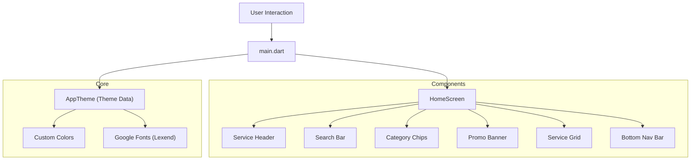
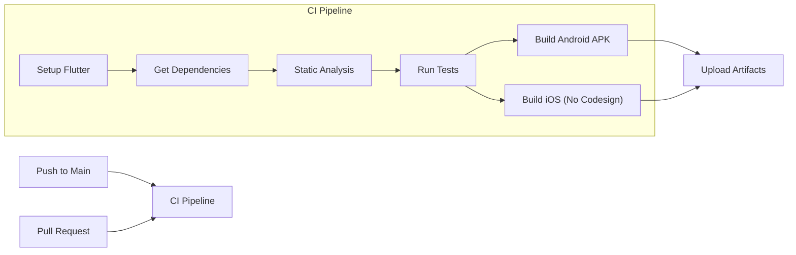

# HomeEase - Tamil Nadu Services Application 🏠✨

A modern, polished Flutter application designed to connect users with essential home services in Tamil Nadu. Built with a focus on premium UI/UX, accessibility, and performance.

> **NEW**: Complete production-ready Supabase backend now available! See [Backend Documentation](#-backend-documentation) below.

## 🌟 Features

### Current Implementation
The application currently features a stunning **Home Screen** implementation with:

- **Custom Theming**: Utilizing a bespoke color palette (Primary Green `#2D5A43`) and the **Lexend** typography for modern readability.
- **Dynamic Header**: personalized greeting with profile integration.
- **Smart Search**: A custom-styled search bar with localization support (Tamil/English).
- **Service Categories**: Horizontal scrolling chips with visual distinction for Emergency services.
- **Promo Banners**: Eye-catching offers with complex mesh gradient backgrounds.
- **Bento Logic Grid**: A responsive, asymmetrical grid layout for service quick-access (e.g., Light Fixtures, Handyman, Moving).
- **Custom Navigation**: A floating, pill-shaped bottom navigation bar with animated state handling.

## 🚀 Architecture

The application follows a component-based architecture for scalability and maintainability.



## 🔮 Future Scope

This project is envisioned to grow into a full-scale service marketplace.

1.  **Booking System**: End-to-end booking flow for services (Plumbing, Cleaning, etc.).
2.  **Service Provider App**: A dedicated interface for professionals to manage requests.
3.  **Real-time Tracking**: Live tracking of service professionals using Google Maps.
4.  **Payment Gateway**: Integration with UPI and Card payments for seamless transactions.
5.  **Multi-language Support**: Full l10n support for Tamil and English across the app.
6.  **Dark Mode**: A system-aware dark theme variant.

## 🤝 Contributing

We welcome contributions from the open-source community!

### How to Contribute
1.  **Fork the Repository**
2.  **Clone the Fork**: `git clone https://github.com/your-username/HomeEase-flutter.git`
3.  **Create a Branch**: `git checkout -b feature/amazing-feature`
4.  **Commit Changes**: `git commit -m 'Add some amazing feature'`
5.  **Push to Branch**: `git push origin feature/amazing-feature`
6.  **Open a Pull Request**

### Guidelines
- Follow the existing folder structure (`lib/components`).
- Ensure code is formatted using `dart format .`.
- Add comments for complex logic.

## 📦 CI/CD Pipeline

We use GitHub Actions to ensure build integrity across platforms.



## 🛠️ Setup & Installation

1.  **Prerequisites**: Flutter SDK (v3.0+), Android Studio / VS Code.
2.  **Installation**:
    ```bash
    flutter pub get
    flutter run
    ```

---

## 🗄️ Backend Documentation

HomeEase now includes a **complete, production-ready Supabase backend** with authentication, database, storage, and serverless functions.

### Quick Start

1. **Verify Backend Setup**
   ```bash
   ./verify_backend.sh
   ```

2. **Deploy to Supabase**
   ```bash
   supabase login
   supabase link --project-ref YOUR_PROJECT_REF
   supabase db push
   ```

3. **Configure Flutter App**
   Update credentials in `lib/services/supabase_service.dart`

### Backend Components

| Component | Description | Files |
|-----------|-------------|-------|
| **Database Schema** | 5 tables with RLS | 3 migration files |
| **Edge Functions** | 4 serverless functions | TypeScript/Deno |
| **Flutter Integration** | Complete service layer | Dart code + examples |
| **Documentation** | 30+ KB of guides | 5 markdown files |

### Documentation Files

- 📘 **[SUPABASE_SETUP.md](./SUPABASE_SETUP.md)** - Complete deployment guide
- 👨‍💼 **[ADMIN_GUIDE.md](./ADMIN_GUIDE.md)** - Admin operations manual
- 🏗️ **[BACKEND_README.md](./BACKEND_README.md)** - Architecture overview
- ✅ **[IMPLEMENTATION_COMPLETE.md](./IMPLEMENTATION_COMPLETE.md)** - Implementation summary
- 📂 **[supabase/README.md](./supabase/README.md)** - Quick reference

### Backend Features

✅ Phone OTP Authentication  
✅ User Profiles with Roles  
✅ Service Catalog Management  
✅ Booking System  
✅ Payment Tracking (Razorpay Ready)  
✅ Support Ticket System  
✅ File Storage (Public & Private)  
✅ Row Level Security  
✅ Real-time Subscriptions  

### Backend Architecture

```
┌─────────────────────────────────────────────────────┐
│                   FLUTTER APP                        │
│  ┌────────────────────────────────────────────┐    │
│  │      supabase_service.dart                  │    │
│  │  (Auth, Profile, Booking, Support, etc.)   │    │
│  └────────────────────────────────────────────┘    │
└─────────────────────────────────────────────────────┘
                         │
                         ▼
┌─────────────────────────────────────────────────────┐
│                 SUPABASE BACKEND                     │
│                                                      │
│  ┌─────────────┐  ┌─────────────┐  ┌────────────┐ │
│  │ PostgreSQL  │  │ Edge        │  │  Storage   │ │
│  │ Database    │  │ Functions   │  │  Buckets   │ │
│  │  + RLS      │  │ (Deno)      │  │ (S3-like)  │ │
│  └─────────────┘  └─────────────┘  └────────────┘ │
│                                                      │
│  Authentication (Phone OTP) → JWT → RLS             │
└─────────────────────────────────────────────────────┘
```

### Database Tables

- **profiles** - User information with role management
- **services** - Home services catalog
- **bookings** - Service booking records
- **payments** - Payment transactions (Razorpay)
- **support_messages** - Customer support tickets

### Edge Functions

- `create-booking` - Create service booking
- `cancel-booking` - Cancel existing booking
- `create-support-message` - Submit support ticket
- `admin-create-service` - Admin: Create new service

---