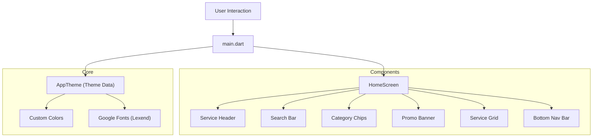
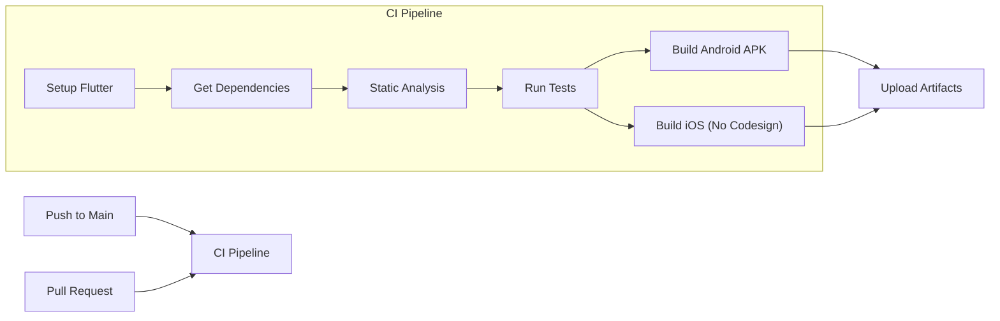

# HomeEase - Tamil Nadu Services Application 🏠✨

A modern, polished Flutter application designed to connect users with essential home services in Tamil Nadu. Built with a focus on premium UI/UX, accessibility, and performance.

## 🌟 Features

### Current Implementation
The application currently features a stunning **Home Screen** implementation with:

- **Custom Theming**: Utilizing a bespoke color palette (Primary Green `#2D5A43`) and the **Lexend** typography for modern readability.
- **Dynamic Header**: personalized greeting with profile integration.
- **Smart Search**: A custom-styled search bar with localization support (Tamil/English).
- **Service Categories**: Horizontal scrolling chips with visual distinction for Emergency services.
- **Promo Banners**: Eye-catching offers with complex mesh gradient backgrounds.
- **Bento Logic Grid**: A responsive, asymmetrical grid layout for service quick-access (e.g., Light Fixtures, Handyman, Moving).
- **Custom Navigation**: A floating, pill-shaped bottom navigation bar with animated state handling.

## 🚀 Architecture

The application follows a component-based architecture for scalability and maintainability.



## 🔮 Future Scope

This project is envisioned to grow into a full-scale service marketplace.

1.  **Booking System**: End-to-end booking flow for services (Plumbing, Cleaning, etc.).
2.  **Service Provider App**: A dedicated interface for professionals to manage requests.
3.  **Real-time Tracking**: Live tracking of service professionals using Google Maps.
4.  **Payment Gateway**: Integration with UPI and Card payments for seamless transactions.
5.  **Multi-language Support**: Full l10n support for Tamil and English across the app.
6.  **Dark Mode**: A system-aware dark theme variant.

## 🤝 Contributing

We welcome contributions from the open-source community!

### How to Contribute
1.  **Fork the Repository**
2.  **Clone the Fork**: `git clone https://github.com/your-username/HomeEase-flutter.git`
3.  **Create a Branch**: `git checkout -b feature/amazing-feature`
4.  **Commit Changes**: `git commit -m 'Add some amazing feature'`
5.  **Push to Branch**: `git push origin feature/amazing-feature`
6.  **Open a Pull Request**

### Guidelines
- Follow the existing folder structure (`lib/components`).
- Ensure code is formatted using `dart format .`.
- Add comments for complex logic.

## 📦 CI/CD Pipeline

We use GitHub Actions to ensure build integrity across platforms.



## 🛠️ Setup & Installation

1.  **Prerequisites**: Flutter SDK (v3.0+), Android Studio / VS Code.
2.  **Installation**:
    ```bash
    flutter pub get
    flutter run
    ```